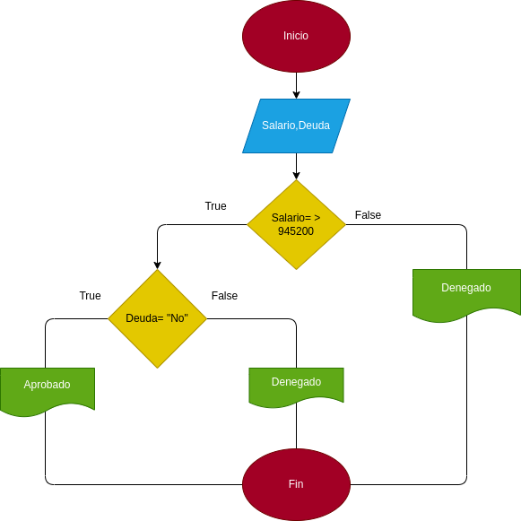

# Estructuras-condicionales
Programa apruebe un prestamo bancario dependiendo el historial crediticio y salario actual de la persona

# ANALISIS

Variables de entrada y proceso (input, processing)

Salario,Deuda: Cosas necesarias para verificar un prestamo

Variables de salida

Salario   
Deuda   
Salario=<   945200  
Deuda= "No"   
Aprobada  
Rechazada

Verifca si una persona es apta para un prestamo bancario

# DISEÑO

# CONSTRUCCION